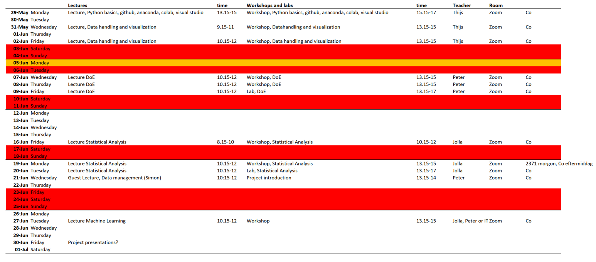

# Data Handling, DoE and Statistical Analysis for Material Chemists: Course Material
This git repository include all material for the DoE course, hosted by the Computational Materials Chemistry group at Uppsala University. This repository will be updated during the course. More information regarding how to use this repository can be found [here](INSTALL.md). 
## Schedule
The schedule for the course is now finalized 

## Content
The material is divided into week: 

[Week 1 - Introduction to data handling and visualization in Python](Week_1/README.md) 

Having passed week 1, you now have a basic understading of python and how to use it. We now encourage you to test and challenge your skills by looking through some examples on how to use python to [solve basic math and statistical problems encountered in chemistry](/Using%20python%20for%20math%20and%20statistics/README.md). This will prepare you for the upcoming lectures which will in more detail introduce design of experiments and statistical analysis of large data sets.   

[Week 2 - Design of Experiments and empirical model building](Week_2/README.md) 

[Week 3 - Statistical analysis of large data sets](Week_3/README.md)

[(extra  Week 4 - Intro to machine learning for material scintists)]Week_4/README.md)

## Using this repository 
The information on how to use this repository ion the most efficient way can be read in [Install.md.](INSTALL.md) 
